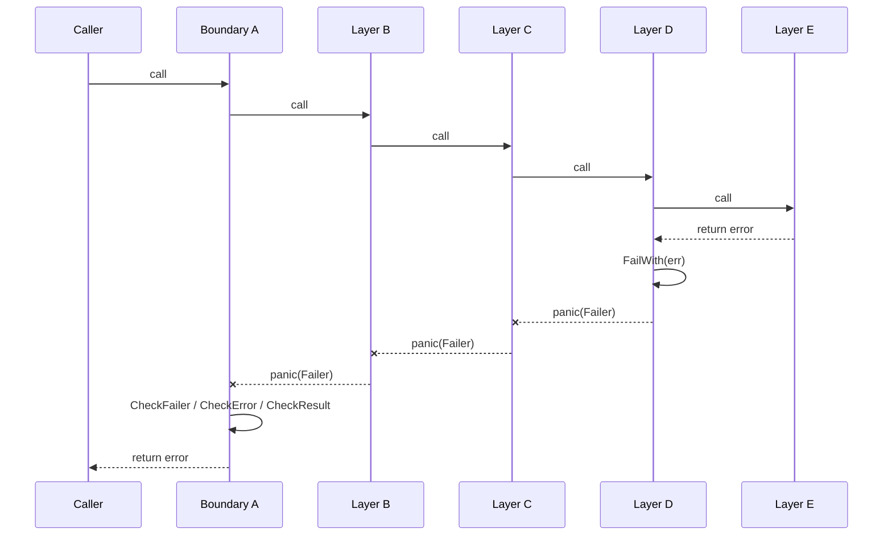
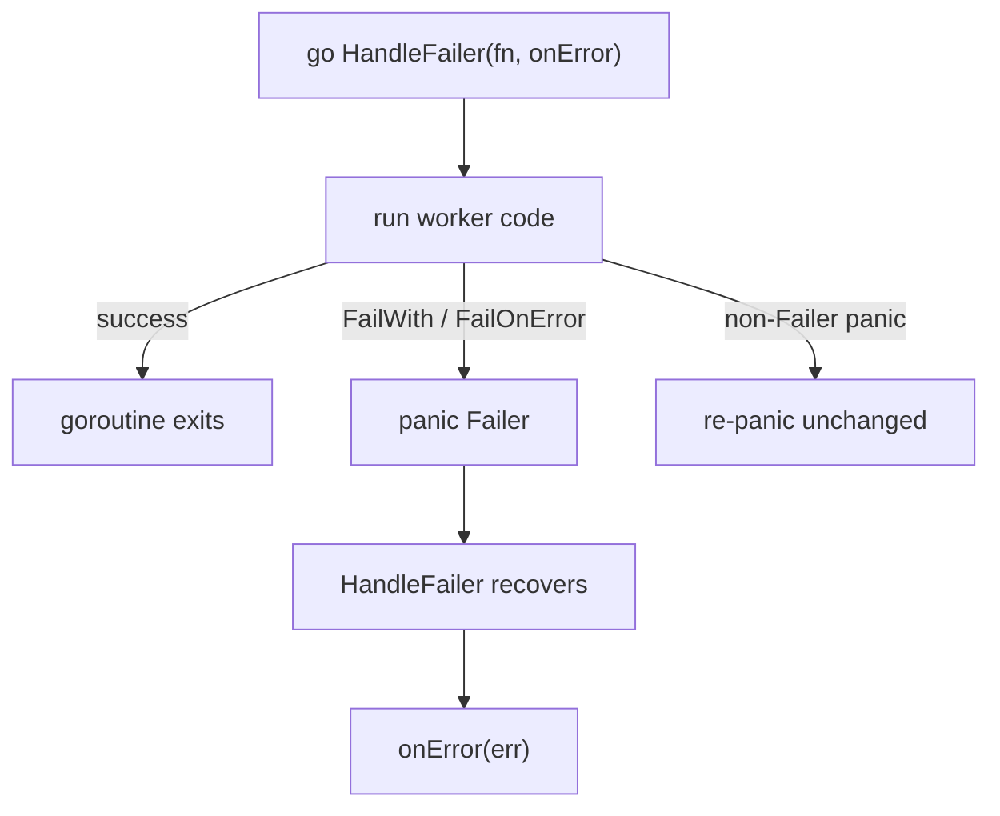

# Relax

[](https://github.com/luckyman42/relax/actions)
[](https://codecov.io/gh/luckyman42/relax)
[](https://goreportcard.com/report/github.com/luckyman42/relax)
[](https://pkg.go.dev/github.com/luckyman42/relax)

[](LICENSE)

> Don't panic - just relax.

`relax` is a focused library for panic-based error propagation inside trusted internal layers.

The goal is simple: let deep internal code fail fast, recover once at a clear boundary, and keep the outward-facing surface of your package in normal Go `error` form.

It is not a replacement for Go's error model. It is a tool for the parts of a codebase where repeated error forwarding adds noise, but the intermediate layers have no real recovery decision to make.

## Installation

```bash
go get github.com/luckyman42/relax
```

```go
import "github.com/luckyman42/relax"
```

## Quick Start

```go
package main

import (
	"errors"
	"fmt"

	"github.com/luckyman42/relax"
)

type User struct {
	Name string
}

func fetchUser(id int) (User, error) {
	return User{}, errors.New("database unavailable")
}

func HandleRequest(id int) error {
	return relax.CheckError(func() error {
		user := relax.FailOnError(fetchUser(id))
		fmt.Println(user.Name)
		return nil
	})
}
```

The mental model is straightforward:

* inside trusted internal code, use `FailOnError*` or `FailWith`
* at the first boundary that should return a normal Go error, use a `Check*` helper

## Why

Go's explicit error handling is one of the language's strengths. It is especially good at API boundaries, where each caller should decide what to do with the failure.

The problem appears in long internal call chains where intermediate layers do not have anything meaningful to add. In a chain like `A -> B -> C -> D -> E`, if only `A` should decide how to handle an error produced by `E`, then `B`, `C`, and `D` often end up doing nothing except forwarding the same error upward.

That usually turns into repeated boilerplate like this:

```go
value, err := next()
if err != nil {
	return err
}
```

With `relax`, the same flow can stay linear:

```go
func A() error {
	return relax.CheckFailer(B)
}

func B() { C() }

func C() { D() }

func D() {
	relax.FailWith(E())
}

func E() error {
	return errors.New("storage unavailable")
}
```

If `E` returned `(T, error)` instead, `D` would typically use `relax.FailOnError(E())`.

The key point is that `B` and `C` do not need to participate in forwarding a failure that only `A` intends to handle anyway.

## Flow Overview

The diagram below shows the core idea of `relax`: deep internal code fails once, the failure unwinds through trusted layers unchanged, and the outer boundary converts it back into a normal Go `error`.



## Public API

### Failure Propagation

Use these helpers inside trusted internal layers when a failure should immediately unwind to an outer boundary.

```go
func FailWith(err error, keyVals ...any)

func FailOnError[T any](v T, err error) T
func FailOnError2[T1, T2 any](v1 T1, v2 T2, err error) (T1, T2)
func FailOnError3[T1, T2, T3 any](v1 T1, v2 T2, v3 T3, err error) (T1, T2, T3)
```

`FailWith` throws an error immediately. The `FailOnError*` helpers are convenience wrappers for the common Go shapes that already return an error.

### Recovery Boundaries

Use these helpers at the edge of the internal call chain, where you want panic-based propagation converted back into ordinary Go errors.

```go
func CheckFailer(fn func()) error
func CheckError(fn func() error) error

func CheckValue[T any](fn func() T) (T, error)
func CheckValue2[T1, T2 any](fn func() (T1, T2)) (T1, T2, error)
func CheckValue3[T1, T2, T3 any](fn func() (T1, T2, T3)) (T1, T2, T3, error)

func CheckResult[T any](fn func() (T, error)) (T, error)
func CheckResult2[T1, T2 any](fn func() (T1, T2, error)) (T1, T2, error)
func CheckResult3[T1, T2, T3 any](fn func() (T1, T2, T3, error)) (T1, T2, T3, error)

func HandleFailer(fn func(), onError func(error))
```

### Supported Function Shapes

The built-in helpers cover the function shapes that come up most often in application code:

* `func()` -> `CheckFailer`
* `func() error` -> `CheckError`
* `func() T` -> `CheckValue`
* `func() (T1, T2)` -> `CheckValue2`
* `func() (T1, T2, T3)` -> `CheckValue3`
* `func() (T, error)` -> `CheckResult`
* `func() (T1, T2, error)` -> `CheckResult2`
* `func() (T1, T2, T3, error)` -> `CheckResult3`
* `(T, error)` -> `FailOnError`
* `(T1, T2, error)` -> `FailOnError2`
* `(T1, T2, T3, error)` -> `FailOnError3`

Support intentionally stops at three non-error return values. Go does not provide a generic abstraction for arbitrary function return arity, so supporting `4+` values would require adding a new exported helper for each additional shape. For those cases, prefer wrapping the values in a struct or dedicated result type and returning fewer parameters through `CheckValue` or `CheckResult`.

### Utilities

```go
type Failer struct {
	Err       error
	Stack     []byte
	Timestamp time.Time
	Context   map[string]any
}

func ConvertToFailer(err error) Failer
func IsFailer(err error) bool
```

Most application code does not need to work with `Failer` directly. It is primarily useful when you want the captured stack trace, timestamp, or structured context.

## Example: Adding Context

`FailWith` can attach structured metadata to the failure as it moves upward:

```go
if err := saveUser(user); err != nil {
	relax.FailWith(err,
		"user_id", user.ID,
		"operation", "save_user",
	)
}
```

If the error is already a `Failer`, the context is merged instead of wrapping it again.

## Working With Underlying Errors

You do not need to know anything about `relax.Failer` to access the original domain error.

`Failer` implements `Unwrap()`, so `errors.As` and `errors.Is` work against the inner error as usual.

```go
type ValidationError struct {
	Field string
}

func (e *ValidationError) Error() string {
	return fmt.Sprintf("invalid %s", e.Field)
}

_, err := relax.CheckValue(func() string {
	relax.FailWith(&ValidationError{Field: "email"})
	return ""
})

var target *ValidationError
if errors.As(err, &target) {
	fmt.Println(target.Field)
}
```

In normal application code this is usually the right approach. Match the original error type you care about and ignore `Failer` completely.

You only need `Failer` itself when you want access to its extra data:

* `Stack`
* `Timestamp`
* `Context`

## Goroutines

For goroutines, make the goroutine boundary explicit and use `HandleFailer` inside the `go` statement:

```go
go relax.HandleFailer(func() {
	user := relax.FailOnError(loadUser(id))
	syncUser(user)
}, func(err error) {
	log.Printf("worker failed: %v", err)
})
```

This keeps ownership of the goroutine launch in your code while still giving you a safe error boundary.

`HandleFailer` recovers only `Failer` panics and forwards them to `onError`. Any non-`Failer` panic is re-panicked unchanged. That means programmer bugs and runtime faults still fail loudly instead of being silently converted into ordinary errors.

Passing a nil `onError` handler panics immediately.



## Design Guarantees

`relax` is intentionally small and opinionated.

It guarantees the following behavior:

* only `Failer` panics are recovered
* non-`Failer` panics propagate unchanged
* the original error is preserved through `Unwrap()`
* stack traces are captured when the failure is created
* existing `Failer` values are not double-wrapped
* `errors.Is` and `errors.As` continue to work normally

## When It Fits Well

`relax` is a good fit for:

* service-layer orchestration
* request and command pipelines
* background jobs and workers
* CLI execution flows
* deep internal call chains where the middle layers only forward failures

It is usually a poor fit for:

* exported public APIs
* low-level reusable libraries consumed by others
* hot performance-critical loops
* ordinary control flow where explicit `error` handling is clearer

## Package Examples

Runnable examples live in `example_test.go` and are also published through pkg.go.dev.

## Testing

```bash
go test ./...
```

```bash
go test -v ./...
```

```bash
go test -bench=. ./...
```

## License

MIT - see `LICENSE`.
