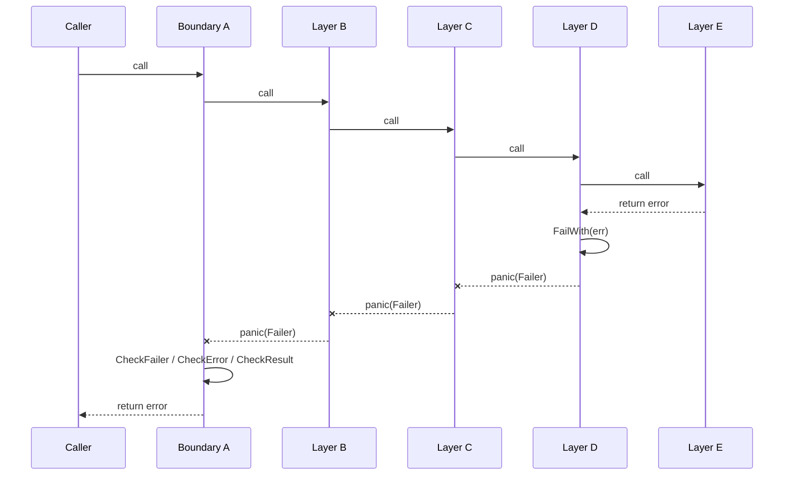

# Relax

[](https://github.com/luckyman42/relax/actions)
[](https://codecov.io/gh/luckyman42/relax)
[](https://goreportcard.com/report/github.com/luckyman42/relax)
[](https://pkg.go.dev/github.com/luckyman42/relax)

[](LICENSE)

> Don't panic - just relax.

`relax` is a small library for panic-based error propagation inside trusted internal call chains. It is not a replacement for Go's error model — it is a tool for the cases where repeated error forwarding through intermediate layers adds noise without adding value.

## Installation

```bash
go get github.com/luckyman42/relax
```

```go
import "github.com/luckyman42/relax"
```

## Quick Start

```go
package main

import (
	"errors"
	"fmt"

	"github.com/luckyman42/relax"
)

type User struct {
	Name string
}

func fetchUser(id int) (User, error) {
	return User{}, errors.New("database unavailable")
}

func HandleRequest(id int) error {
	return relax.CheckError(func() error {
		user := relax.FailOnError(fetchUser(id))
		fmt.Println(user.Name)
		return nil
	})
}
```

Inside the boundary: use `FailOnError*` or `FailWith`. At the boundary that should return a normal Go error: use a `Check*` helper.

## The Problem This Solves

Go's explicit error handling is one of the language's strengths at API boundaries. But in a deep internal call chain like `A → B → C → D → E`, when only `A` handles the failure that `E` produces, every intermediate layer ends up doing nothing except forwarding:

```go
value, err := next()
if err != nil {
	return err  // B, C, D all do this — none of them can do anything else
}
```

This is the boilerplate the Go team acknowledged but deliberately left to library authors to address. `relax` fills that gap for trusted internal layers.

With `relax`, the same chain stays linear:

```go
func A() error {
	return relax.CheckFailer(B)
}

func B() { C() }

func C() { D() }

func D() {
	relax.FailWith(E())
}

func E() error {
	return errors.New("storage unavailable")
}
```

`B` and `C` do not participate in forwarding a failure that only `A` intends to handle. If `E` returned `(T, error)` instead, `D` would use `relax.FailOnError(E())`.

Only `Failer` panics are recovered at the boundary. Programmer errors and runtime faults — nil pointer dereferences, index out of range — still propagate unchanged. The recovery boundary is explicit and visible in the code, not inferred from the runtime.

## Flow Overview

The diagram below shows the core idea: deep internal code fails once, the failure unwinds through trusted layers unchanged, and the outer boundary converts it back into a normal Go `error`.



## Public API

### Failure Propagation

Use these helpers inside trusted internal layers when a failure should immediately unwind to an outer boundary.

```go
func FailWith(err error, keyVals ...any)

func FailOnError[T any](v T, err error) T
func FailOnError2[T1, T2 any](v1 T1, v2 T2, err error) (T1, T2)
func FailOnError3[T1, T2, T3 any](v1 T1, v2 T2, v3 T3, err error) (T1, T2, T3)
```

`FailWith` throws an error immediately. The `FailOnError*` helpers are convenience wrappers for the common Go shapes that already return an error.

### Recovery Boundaries

Use these helpers at the edge of the internal call chain, where panic-based propagation should be converted back into ordinary Go errors.

```go
func CheckFailer(fn func()) error
func CheckError(fn func() error) error

func CheckValue[T any](fn func() T) (T, error)
func CheckValue2[T1, T2 any](fn func() (T1, T2)) (T1, T2, error)
func CheckValue3[T1, T2, T3 any](fn func() (T1, T2, T3)) (T1, T2, T3, error)

func CheckResult[T any](fn func() (T, error)) (T, error)
func CheckResult2[T1, T2 any](fn func() (T1, T2, error)) (T1, T2, error)
func CheckResult3[T1, T2, T3 any](fn func() (T1, T2, T3, error)) (T1, T2, T3, error)

func HandleFailer(fn func(), onError func(error))
```

### Supported Function Shapes

**At the propagation point** — used inside a trusted layer; returns values on success, panics with a `Failer` on error:

| Call shape | Helper | Returns on success | On error |
|---|---|---|---|
| `(T, error)` | `FailOnError` | `T` | panics |
| `(T1, T2, error)` | `FailOnError2` | `T1, T2` | panics |
| `(T1, T2, T3, error)` | `FailOnError3` | `T1, T2, T3` | panics |

**At the recovery boundary** — wraps a closure; catches `Failer` panics and converts them into a returned `error`:

| Wraps | Helper | Returns |
|---|---|---|
| `func()` | `CheckFailer` | `error` |
| `func() error` | `CheckError` | `error` |
| `func() T` | `CheckValue` | `T, error` |
| `func() (T1, T2)` | `CheckValue2` | `T1, T2, error` |
| `func() (T1, T2, T3)` | `CheckValue3` | `T1, T2, T3, error` |
| `func() (T, error)` | `CheckResult` | `T, error` |
| `func() (T1, T2, error)` | `CheckResult2` | `T1, T2, error` |
| `func() (T1, T2, T3, error)` | `CheckResult3` | `T1, T2, T3, error` |
| `func()` + `func(error)` | `HandleFailer` | — (calls the handler) |

Support stops at three non-error return values. For four or more, wrap the values in a struct and use `CheckValue` or `CheckResult`.

### Utilities

```go
type Failer struct {
	Err     error
	Context map[string]any
}

func ConvertToFailer(err error) Failer
func IsFailer(err error) bool
```

Most application code does not need to work with `Failer` directly. It is primarily useful when you want the structured context attached to a failure.

## Adding Context

`FailWith` can attach structured metadata to the failure as it unwinds:

```go
if err := saveUser(user); err != nil {
	relax.FailWith(err,
		"user_id", user.ID,
		"operation", "save_user",
	)
}
```

If the error is already a `Failer`, the context is merged instead of wrapping it again. Keys are stringified using `fmt.Sprint`; the last write wins for a given key. To avoid collisions when multiple layers annotate the same failure, use namespaced keys:

```go
relax.FailWith(err, "db.operation", "save")
relax.FailWith(err, "http.operation", "POST /users")
```

## Working With Errors

You do not need to know anything about `relax.Failer` to access the original domain error. `Failer` implements `Unwrap()`, so `errors.As` and `errors.Is` work against the inner error as usual:

```go
type ValidationError struct {
	Field string
}

func (e *ValidationError) Error() string {
	return fmt.Sprintf("invalid %s", e.Field)
}

_, err := relax.CheckValue(func() string {
	relax.FailWith(&ValidationError{Field: "email"})
	return ""
})

var target *ValidationError
if errors.As(err, &target) {
	fmt.Println(target.Field) // email
}
```

You only need `Failer` itself when you want the structured `Context` attached to a failure.

**Common composition patterns:**

`fmt.Errorf` with `%w` — add context while keeping the error chain intact:

```go
relax.FailWith(fmt.Errorf("loading user %d: %w", id, err))
```

Sentinel errors with `errors.Is` — works automatically through `Failer.Unwrap()`:

```go
var ErrNotFound = errors.New("not found")

relax.FailWith(ErrNotFound)
...
errors.Is(err, ErrNotFound) // true at the boundary
```

`errors.Join` (Go 1.20+) — when multiple errors occur inside a boundary:

```go
relax.FailWith(errors.Join(errValidation, errDatabase))
```

Stack traces are not captured by `relax` — this is intentional. Capture is expensive and belongs in your logger or tracing layer, not in the error itself. If you need traces attached to the error value, wrap before passing to `FailWith`:

```go
relax.FailWith(fmt.Errorf("operation failed: %w", err))
```

## Goroutines

Make the goroutine boundary explicit and use `HandleFailer` inside the `go` statement:

```go
go relax.HandleFailer(func() {
	user := relax.FailOnError(loadUser(id))
	syncUser(user)
}, func(err error) {
	log.Printf("worker failed: %v", err)
})
```

`HandleFailer` recovers only `Failer` panics and forwards them to `onError`. Any non-`Failer` panic is re-panicked unchanged — programmer bugs and runtime faults still fail loudly. Passing a nil `onError` panics immediately.

```mermaid
flowchart TD
	Start["go HandleFailer(fn, onError)"] --> Run[run worker code]
	Run -->|success| Exit[goroutine exits]
	Run -->|FailWith / FailOnError| Panic[panic Failer]
	Panic --> Recover[HandleFailer recovers]
	Recover --> Forward["onError(err)"]
	Run -->|non-Failer panic| Repanic[re-panic unchanged]
```



## Performance

Measured on AMD Ryzen AI 9 HX 370, Go 1.25, linux/amd64.

`relax` has a fixed, constant cost: one `defer` on the happy path, one `panic+recover` on the error path. Neither scales with depth or complexity.

### Happy path

The `defer` at the boundary costs ≈ 10 ns. Explicit propagation accumulates `(T, error)` return overhead at each frame crossing; relax does not. As the chain grows, explicit gets more expensive while relax stays flat — they meet at depth ≈ 8.

| Depth | Explicit | relax | Δ |
|---|---|---|---|
| 1 | 6 ns | 14 ns | +8 ns |
| 5 | 17 ns | 20 ns | +3 ns |
| **8** | **25 ns** | **24 ns** | **≈ 0** |
| 10 | 31 ns | 26 ns | −5 ns |

### Error path

`panic+recover` costs ≈ 400–700 ns · 48 B · 2 allocs per triggered failure. The panic mechanism dominates — depth adds very little on top. The 2 allocations (`Failer` struct + boxed interface value) happen once per error, not once per frame.

| Depth | Explicit | relax |
|---|---|---|
| 1 | 6 ns · 0 B | 434 ns · 48 B · 2 allocs |
| 5 | 16 ns · 0 B | 573 ns · 48 B · 2 allocs |
| 10 | 30 ns · 0 B | 735 ns · 48 B · 2 allocs |

With 4 context key-value pairs attached to the failure: ≈ 1030 ns · 400 B · 8 allocs.

### Conclusion

Performance is not a reason to avoid `relax`. On the happy path the overhead is a single constant that shrinks to zero as the chain grows — at depth 8 it is already unmeasurable. On the error path the extra ≈ 400–700 ns is real but irrelevant in practice: a database round-trip costs 100 µs–10 ms, two to three orders of magnitude more. The overhead only matters in a hot loop that triggers errors at high frequency with no I/O — which is not the use case `relax` is designed for.

Run `go test -bench=. -benchmem ./...` to measure on your own hardware.

## When It Fits Well

`relax` is a good fit for:

* service-layer orchestration
* request and command pipelines
* background jobs and workers
* CLI execution flows
* deep internal call chains where the middle layers only forward failures

It is usually a poor fit for:

* exported public APIs
* low-level reusable libraries consumed by others
* hot performance-critical loops
* ordinary control flow where explicit `error` handling is clearer

## Design Guarantees

* Only `Failer` panics are recovered.
* Non-`Failer` panics propagate unchanged.
* The original error is preserved through `Unwrap()`.
* Existing `Failer` values are never double-wrapped.
* `errors.Is` and `errors.As` continue to work normally.
* `FailWith(nil)` is always a no-op.
* `HandleFailer` with a nil `onError` panics immediately.

## Testing

```bash
go test ./...
go test -v ./...
go test -bench=. -benchmem ./...
```

## Agent Skill

A self-contained AI skill lives in `.github/skills/relax/` and includes the full API surface so agents can generate correct code without access to this source. Copy the folder to use it in other projects.

## License

MIT - see `LICENSE`.
